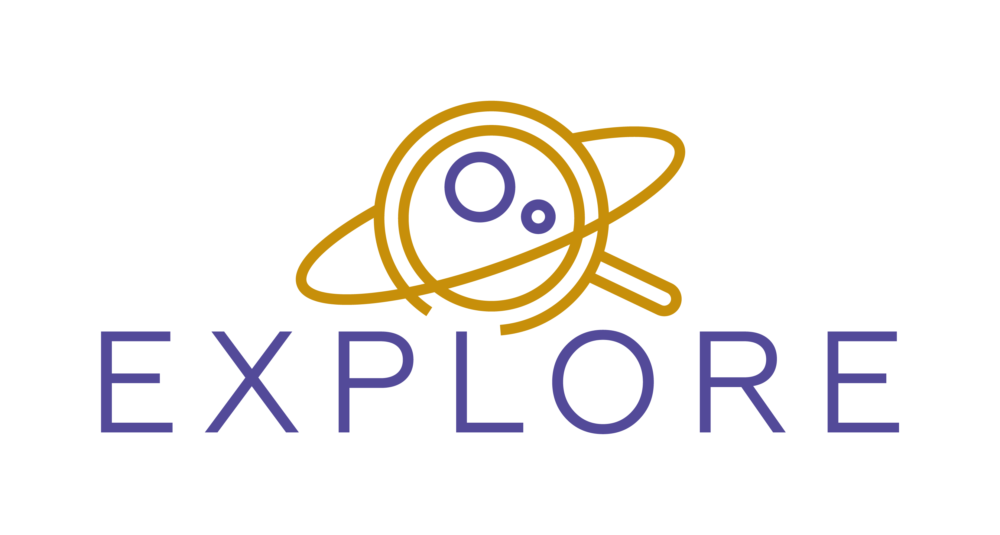

## EXPLORE - Innovative Scientific Data Exploration and Exploitation Applications for Space Sciences

EXPLORE’s main objective is to deploy machine learning (ML) and advanced visualization tools to achieve efficient, user-friendly, realistic exploitation of scientific data from astrophysics and planetary space missions, as well as from supporting ground-based massive surveys. We focus on six different topics, each chosen for their timely importance and their complementary data structures. This diversity and complementarity is key to a future evolution and growth of the platform that is relevant and applicable to the broadest possible user-base within the research community. Two of EXPLORE’s topics are related to Lunar observation, two to Galactic Science and two to stellar characterization. For each of these topics, the state-of-the-art will be enhanced by introducing ML techniques and advanced visualization tools to support “Human Learning”. 

For each topic, specific tools are created. These Scientific Data Application (or simply Apps) are developed on a dedicated cloud solution (the EXPLORE platform, https://explore-platform.eu). The EXPLORE Apps are also made available on existing cloud platforms such as ESA Datalabs, close to the input data, and open to the community for direct exploitation-on-demand. The EXPLORE Apps are also be used by the consortium to produce enhanced scientific datasets for space science mission exploitation, which will be stored in appropriate archives for public access. Datasets from Gaia and recent lunar (LRO, Clementine, Chandrayaan, etc) space missions are at the core of the EXPLORE project and are complemented with data from previous space missions as well as ground-based surveys.

## Get involved!

You are most welcome to get involved to improve the different scientfic data appplications we develop for the EXPLORE project. 
More information on how to get involved (from proposing new features to submitting pull requests) see our [project info](https://github.com/explore-platform/explore)

## Get inspiration!

We also hope that the EXPLORE scientific apps serve as starting points or inspiration for anyone to create their own (science) apps and share them as part of the Open Science initiative on different science platforms. Contact us `contact@explore-platform.eu` to discuss deploying your astro/space science app on the EXPLORE platform!

## Funding

This project has received funding from the European Union’s Horizon 2020 research and innovation programme under grant agreement No 101004214.  
  

